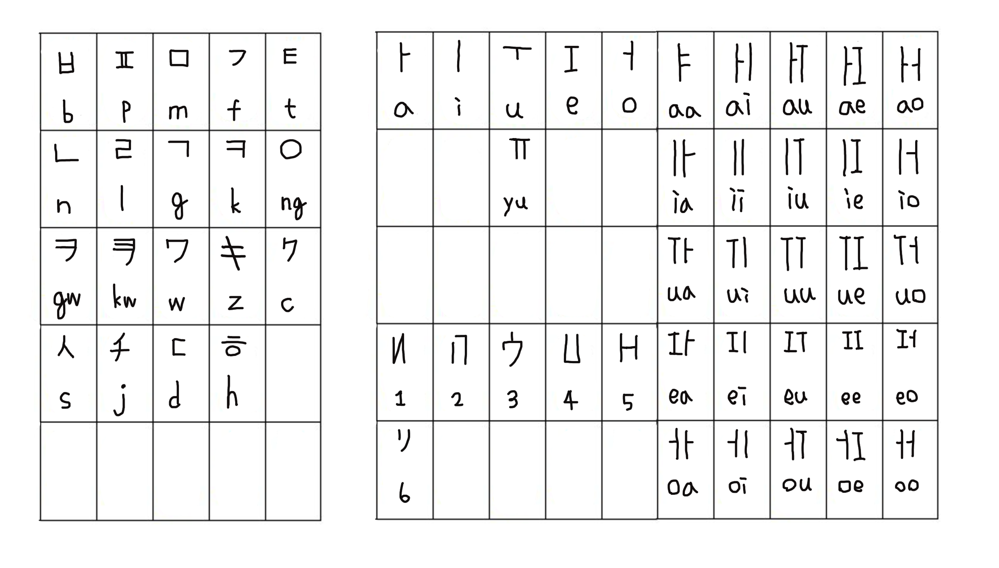

# 粵語音節文字（Cantonese Syllabic Script）

本文字系統是一套專為現代標準粵語（廣州話/香港粵語）設計的音節方塊文字。系統融合朝鮮諺文（Hangul）的組字幾何思維與日文假名、拉丁字母的造字筆畫，將粵語每個完整音節（聲、韻、調）規整於單一等寬方塊之內，既具備拼音文字的表音準確性，又保留漢字的方塊閱讀節奏與版面美感。

---

## 一、字符組成要素

一套完整的粵語音節字符由四個核心部件構成：初聲（聲母）、中聲（元音/韻腹）、終聲（尾音/韻尾）及調符（聲調）。

### 字符總表

### 1. 初聲（聲母，19 個）
聲母固定置於字塊之**左上方**：

| 類別 | 拼音字母 | 字符 | 備註 / 字形來源 |
| :--- | :--- | :---: | :--- |
| **塞音與塞擦音** | b | ㅂ | 諺文 |
| | p | ㅍ | 諺文 |
| | d | ㄷ | 諺文 |
| | t | ㅌ | 諺文 |
| | g | ㄱ | 諺文 |
| | k | ㅋ | 諺文 |
| | z | キ | 日文片假名 |
| | c | ク | 日文片假名 |
| **圓唇化軟顎音** | gw | ヲ  | ヲ 日文片假名 |
| | kw | ヲ+ㄱ | ヲ 上加ㄱ |
| **鼻音與邊音** | m | ㅁ | 諺文 |
| | n | ㄴ | 諺文 |
| | ng | ㅇ | 諺文 |
| | l | ㄹ | 諺文 |
| **擦音與半元音** | f | フ | 日文片假名 |
| | s | ㅅ | 諺文 |
| | h | ㅎ | 諺文 |
| | w | ワ | 日文片假名 |
| | j | チ | 日文片假名 |

---

### 2. 中聲（元音與韻腹）
元音固定置於字塊之**右上方或頂部**：

#### (1) 基礎單元音與長元音
* **a (短 a)**：`ㅏ`
* **i**：`|`
* **u**：`ㅜ`
* **e**：`I`
* **o**：`ㅓ`
* **yu**：`ㅠ`（細音圓唇元音，如「於」）
* **aa (長元音專用符)**：`ㅑ`（用於與短 a 作音值區分，如「三」之韻腹）

#### (2) 二合雙元音拼合律
採「前元音 ＋ 後元音」在右上方格內左右緊湊拼合：
* **普通雙元音**：
  * ai (`ㅏ\|`), au (`ㅏㅜ`), ei (`I|`), oi (`ㅓ|`), ou (`ㅓㅜ`), ui (`ㅜ|`), iu (`|ㅜ`)
* **長音二合**：
  * aai (`ㅑ|`), aau (`ㅑㅜ`)
* **圓唇複合音**：
  * oe (`ㅓI`), eo (`Iㅓ`), eoi (`Iㅓ|`，如「水、去」)

---

### 3. 終聲（尾音/韻尾，6 個輔音）
本系統採取**「初終同符」**原則：所有尾音均直接複用初聲（聲母）字符，置於字塊之**左下方**：

* **鼻音韻尾**：
  * `-m` (`ㅁ`), `-n` (`ㄴ`), `-ng` (`ㅇ`)
* **入聲塞音韻尾**：
  * `-p` (`ㅍ`), `-t` (`ㅌ`), `-k` (`ㅋ`)

---

### 4. 調符（聲調，6 個幾何標記）
調符固定置於方塊之**右下方或底部**，嚴格對應粵語六個調值，直接整合進方塊結構內部：

| 聲調 | 調名與調值 | 調符字符 | 入聲對應關係 |
| :---: | :--- | :---: | :--- |
| **1** | 陰平 (55/53) | **И** | 上陰入（7聲）取 **И** |
| **2** | 陰上 (35) | **П** | — |
| **3** | 陰去 (33) | **ウ** | 下陰入（8聲）取 **ウ** |
| **4** | 陽平 (21/11) | **凵** | — |
| **5** | 陽上 (13/23) | **H** | — |
| **6** | 陽去 (22) | **リ** | 陽入（9聲）取 **リ** |

> **入聲歸調準則**：帶入聲尾（-p, -t, -k）之音節依其調值歸併，上陰入取 **И**，下陰入取 **ウ**，陽入取 **リ**。

---

## 二、拼字結構與位置規範

本文字系統依照音節所包含的部件，分為以下七種字形結構：

1. **第一種：只有母音（元音）**
   * 母音直接佔據整個方塊。
2. **第二種：只有聲母**
   * 聲母（成音節鼻音，如 m、ng）直接佔據整個方塊。
3. **第三種：母音 ＋ 聲調**
   * 母音放在上方，聲調放在下方。
4. **第四種：聲母 ＋ 聲調**
   * 聲母（成音節鼻音）放在上方，聲調放在下方。
5. **第五種：聲母 ＋ 母音 ＋ 聲調**
   * 聲母放在左上方，母音放在右上方，聲調放在下方。
6. **第六種：母音 ＋ 尾音 ＋ 聲調**
   * 母音放在上方，尾音放在左下方，聲調放在右下方（或下方右側）。
7. **第七種：聲母 ＋ 母音 ＋ 尾音 ＋ 聲調（四種齊全）**
   * 聲母放在左上方，母音放在右上方，尾音放在左下方，聲調放在右下方。

---

## 三、位置基本公理

1. **母音（元音）**：永遠只會固定出現在整個方塊或上方或右上方，絕不出現在左側或下方。
2. **聲母**：永遠只會固定出現在整個方塊或上方或左上方。
3. **尾音**：永遠只會固定出現在左下方。
4. **聲調**：永遠只會固定出現在下方或右下方。

---

## 四、版型示意圖

